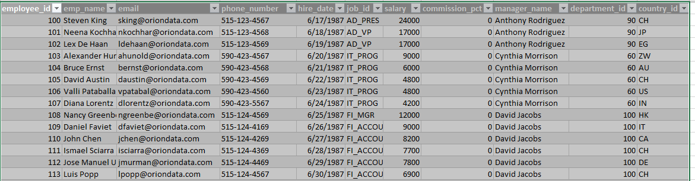

# Orion Data Systems Workforce Analytics

## Executive summary
The analysis was conducted to give insight to the HR and strategy team at Orion Data Systems on their workforce database to support decision making. The analysis answered questions like how many employees are in each department, the department with the highest average salary, the countries where orion data system operates and how many departments are in each country, the high earners in the company, departments, manager name and the number of employees under them, job roles and their salaries and so much more.

## Business Context
The HR & Strategy team needs insights from their workforce database to support decision-making. The goal is to answer the business questions using SQL.

## Objectives
The objectives of this analysis is to achieve the following:
- Answer the business Questions.
- To give insights from their workforce database to support decision making.

## Data Overview
The analysis is based on four datasets from Orion data system workforce namely: employees, departments, countries and jobs. It is a record of all employees, departments, countries and jobs within the Orion Data Systems.

## Data Preview

## Findings And Analysis
### Workforce distribution
- Shipping department has the highest number of employees with forty-five, followed by Sales with thirty-four, Finance and Purchasing departments with six employees each, IT with five employees, Executive with three, Marketing and Accounting with two employees each while Administration, Human resource and Public relation department have the least number of employees with just one each.

## Salary comparison
- The Executive department with an average salary of $19,333 has the highest average salary while the Shipping department with an average salary of $3476 has the lowest average salary.

### Salary bands for Employees
- There are fifteen (15) employees earning over $10,000 (high), forty-three (43) employees earning between $5000 and $10,000 (Medium) and forty-nine (49) employees earning below $5,000 (Low).

### Country level analysis
- Switzerland with eleven (11) departments is the country with the most departments, followed by Italy and China with seven departments each, Mexico, Kuwait, Brazil, Egypt and India with six departments each, Japan, United States of America and Israel with five departments each, Australia, Belgium, Singapore, Germany and Argentina with four departments each, Canada, Denmark and Hong Kong with three each, Zimbabwe with two while Zambia, France, United Kingdom, Nigeria and Netherland have the least department with one each.
  
### High Earners
- There are fifty-one employees earning above the company’s average salary of $6,642.
  
### Department Leaders
- Shipping department with manager Michael Johnson has the highest number of employees under him with forty-five, followed by Sales with manager Sophia Martinez with thirty-four, Finance with manager David Jacobs and Purchasing department with manager Rebecca Chen with six employees each, IT department with manager Cynthia Morrison with five employees, Executive department with manager Anthony Rodriguez with three, Marketing with manager Robert Steinberg and Accounting with manager Grace Thompson with two employees each while Administration with manager Fatima Suleiman, Human resource with manager Linda Kapoor and Public relation department with manager Ethan Williams have the least number of employees with just one each.

### Job role Analysis
-The President with average salary of $30,000, Administration Vice President with average salary of $22,500, Sales manager with average salary of $15,000, Finance manager and Account manager with average salary of $ 12,100 are the job titles with average salary greater than $12,000.

### Employee Ranking
- In Accounting department, the most ranked employee is Shelley Higgins, in Administration department, the most ranked employee is Jennifer Whalen, in Executive department, Stephen King is the most ranked, in finance, Nancy Greenberg is the most ranked employee, in Human resource it is Susan Mavris, in IT, it is Alexander Hunold, in marketing, it is Michael Hartstein, in Public relation, it is Hermann Baer, in purchasing, it is Den Raphaely, in sales, it is John Russel and in Shipping, it is Adam Fripp.

### Salary and Growth Trend
- Switzerland is the country paying the most salary with a total salary of $75,100, Italy is second with total salary of $52,100, followed by Israel with total salary of $45,200, then Argentina with $43,600 total salary, China with total salary of $42,400, Egypt with a total salary of $41,600, Brazil with $38,000, Japan and Belgium with $33,600, India with $32,800, United State of America with $31,600, Kuwait with $25,500, Hong Kong with $24,700, Germany with $23,500, Australia with $23,300, Mexico with $22,200, Zimbabwe with $18,000, Canada with $17,700, Singapore with $17,300, Denmark with $13,400, Netherlands $12,000, Nigeria $10,000, Zambia $9,500, France $2,500 and United Kingdom with $2,200.

### Workforce Gaps
- There is currently no job role without an employee.
  
## Recommendations
- The salary of those in the shipping department should be reviewed as it is very low compared to other departments.
- The United State of America’s large market should be further explored as the activities there are low.
- The salary of employees who are earning below the average salary should be reviewed to motivate the workers to work more.

## Tools Used
- MySQL for analysis.
- Google docs for reporting.

## Conclusion 
This project was done using MySQL on Orion data system workforce and it gives insight into their workforce distribution, salary comparison, salary bands for employees, country level analysis, high earners, department leaders, job role analysis, employee ranking, salary growth trend and workforce gaps.

